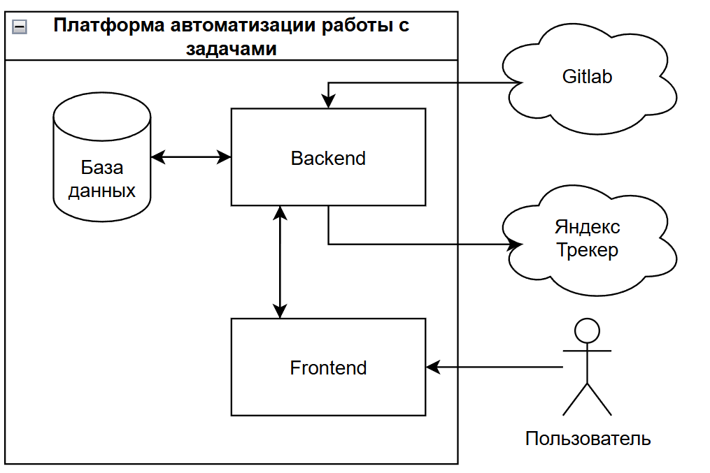
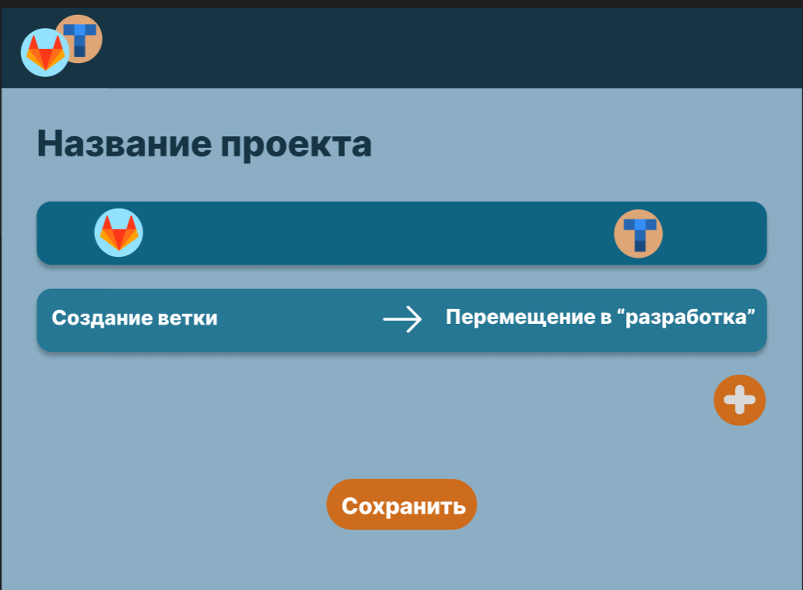
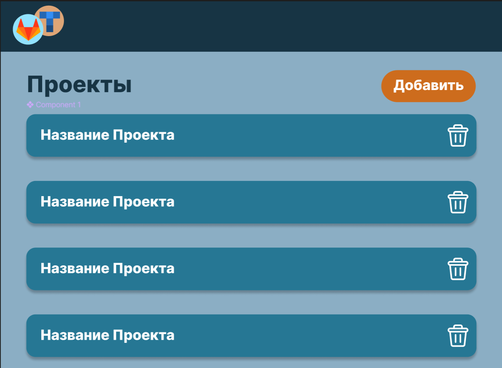

# Архитектура YaGit

## Общая схема

YaGit состоит из трёх основных слоёв:

1. **Внешние источники** — GitLab (Webhook) и Яндекс.Трекер (REST API)
2. **Сервисный слой** — FastAPI‑приложение со слоями Application → Services → Infrastructure
3. **Хранилища** — PostgreSQL (данные проектов и правил), Redis (фоновые задания)

Взаимодействие сервисов оркестрируется брокером очередей `asyncio.Queue`. Благодаря этому webhook‑эндпоинт остаётся быстрым (возвращает `202 Accepted`), а тяжёлые операции выполняются асинхронно.

## Сценарий «Merge Request opened»

1. GitLab отправляет webhook `Merge Request opened`
2. YaGit ищет подходящее правило  
   `MATCH (event == 'mr_opened' AND branch == 'feature/*')`
3. Если правило найдено:  
   3.1. Кладёт задание в очередь  
   3.2. Worker вызывает Яндекс.Трекер API  
   3.3. Обновляет статус задачи

## Модель данных

Подробности схемы и миграций — в директории `yagit/db/` (Alembic).

