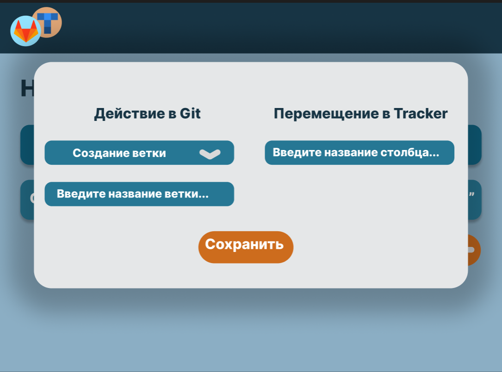
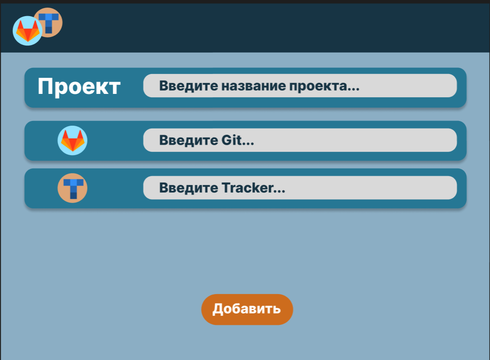

# Дизайн и UX

## Пользовательский сценарий

Администратор:

1. Регистрирует проект c GitLab URL и токеном OAuth.
2. Создаёт правило *«При пуше в `main` → Перевести задачу в колонку `Review`»*.
3. Проверяет событие в журнале и, при необходимости, правит шаблоны комментариев.

## Интерфейс

### Принципы дизайна

- **Минимум кликов**: все основные действия доступны с главного экрана.

- **Подсветка статуса**: цветовая индикация успешной/ошибочной обработки webhook‑ов.

Компонентная библиотека: **ant-design-vue** (по ТЗ), стили— **TailwindCSS**.

